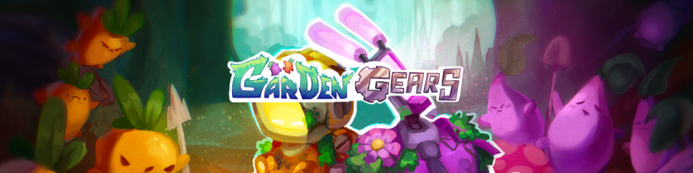

## 📝 About

Garden Gears is a 2vs2 MOBA.  
You play as robots who defend radioactive carrot and turnip camps in a swampy universe.

## 🏎️ Main feature

I was given the opportunity to develop a competitive online game with the help of Photon Network.  
We developed an online game where player synchronization is essential.  
In this project, we used Photon to manage the network part to help us synchronize the clients with each other.

## 💼 What I've done

| Name             | Description                       |
| :--------------: | :-------------------------------: |
| AI FSM           | Development of AI enemies         |
| Debug            | Debugging problems and playtesting |
| Integration      | Take care of integrating artists' assets |
| Network          | Integrate and check the operation of the network game |

## 🔗 Links

